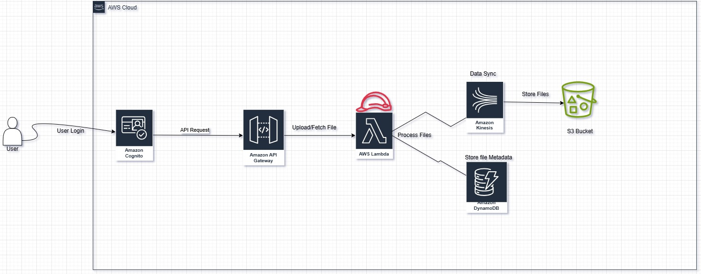

# CloudBox ☁️📦

CloudBox is a cloud-based file storage and retrieval system that allows users to securely upload, store, and access files using AWS services like S3, CloudFront, Cognito, and more.



## Features 🚀
- **Secure File Upload & Retrieval**: Upload files to AWS S3 with metadata stored in DynamoDB.
- **Pre-signed URLs**: Generate time-limited URLs for secure file access.
- **AWS Lambda Integration**: Automate file processing and metadata management.
- **Kinesis Firehose**: Stream logs and events for monitoring.

## Architecture
CloudBox follows a serverless design using:
- **Amazon Cognito** for user authentication.
- **API Gateway**: Provides RESTful endpoints for file operations.
- **Amazon S3** for file storage.
- **Amazon DynamoDB** for metadata storage.
- **AWS Lambda** for serverless compute.
- **Amazon Kinesis Firehose** for log processing.

## Deployment
To deploy CloudBox, ensure you have AWS CLI and Terraform installed. Then clone the repository:
```sh
git clone https://github.com/Stefanie-A/CloudBox.git
cd CloudBox
terraform init
terraform apply
```
Once deployed, Terraform will output relevant details like:
- **Cognito Login URL**
- **API Gateway Endpoints**

## Usage
###  Starting the App Locally
To start the app locally for development and testing purposes, follow these steps:

1. **Install Dependencies**:
   - Ensure you have Python and pip installed.
   - Navigate to the `app` directory and install the required dependencies:
     ```sh
     cd app
     pip install -r requirements.txt
     ```

2. **Set Environment Variables**:
   - Create a `.env` file in the `app` directory with the following content:
     ```env
     DYNAMODB_TABLE=S3FileMetadata
     KINESIS_STREAM=your-kinesis-stream-name
     S3_BUCKET=your-s3-bucket-name
     ```

3. **Run the Flask App**:
   - Start the Flask development server:
     ```sh
     flask run
     ```
   - The app will be available at `http://127.0.0.1:5000`.
   
### Sign Up via Cognito
1. **Sign Up**:
   - Navigate to the Cognito Login URL provided by Terraform.
   - Click on the "Sign Up" link.
   - Enter your email, password, and other required details.
   - Verify your email address by entering the verification code sent to your email.

### Upload a File
1. **Request a Pre-signed URL**:
   - Use Postman to send a POST request to the `/upload` endpoint.
   - **Endpoint**: `/upload`
   - **Method**: `POST`
   - **Request Body**:
     ```json
     {
       "file": "example.txt",
       "user_id": "user@example.com",
     }
     ```
   - **Response**:
     ```json
     {
       "message": "File uploaded successfully"
     }
     ```

2. **Upload Your File**:
   - Use the pre-signed URL provided in the response to upload your file.

### Retrieve a File
1. **Fetch the Pre-signed URL**:
   - Use Postman to send a GET request to the `/fetch` endpoint.
   - **Endpoint**: `/fetch`
   - **Method**: `GET`
   - **Query Parameters**:
     - `file_id`: The ID of the file to fetch.
     - `user_id`: The ID of the user who owns the file.
   - **Response**:
     ```json
     {
       "file_id": "YOUR-FILE-ID",
       "file_key": "YOUR-FILE-KEY",
       "file_name": "YOUR-FILE-NAME",
       "timestamp": "2025-03-24T18:20:51.056393",
       "user_id": "YOUR-USER-ID",
       "presigned_url": "https://example.com/presigned-url"
     }
     ```

2. **Download the File**:
   - Use the pre-signed URL provided in the response to download your file.


3. **Monitor Logs**:
   - Check CloudWatch logs for AWS Lambda execution.
   - Review Firehose streams for analytics.

## Troubleshooting
- **Access Denied (403) on CloudFront**:
  - Ensure your S3 bucket policy allows public read access via CloudFront.
  - Verify CloudFront is configured with the correct origin access control.

- **Pre-signed URL Expired**:
  - Ensure the URL is used before expiry.
  - Regenerate the pre-signed URL if necessary.

## Contributing
Contributions are welcome! Feel free to submit pull requests or report issues in the GitHub repository.

## License
This project is licensed under the MIT License.